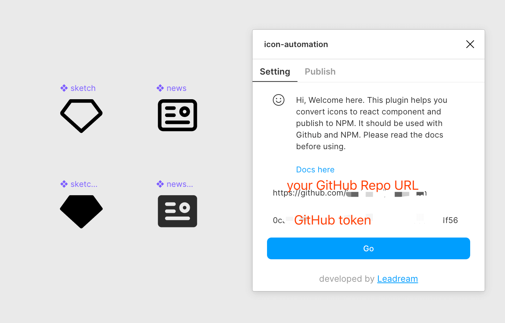
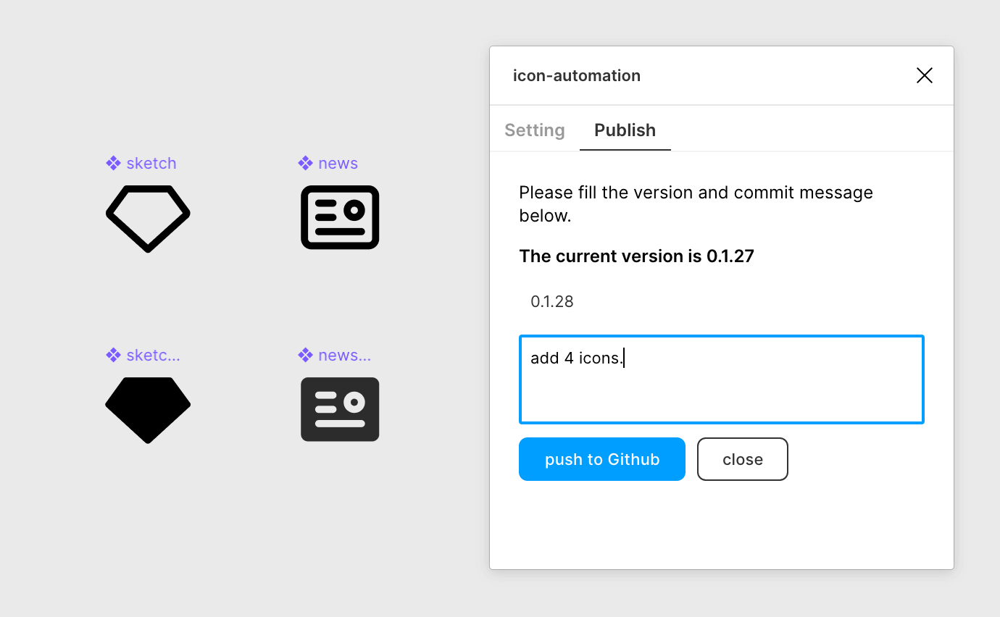
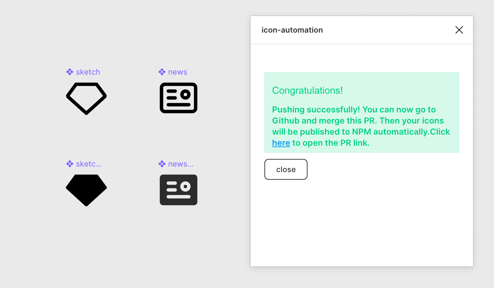
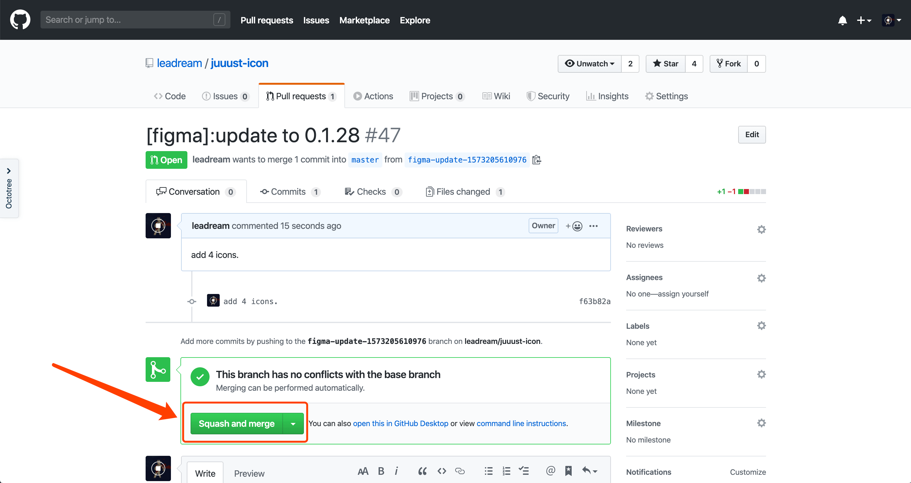
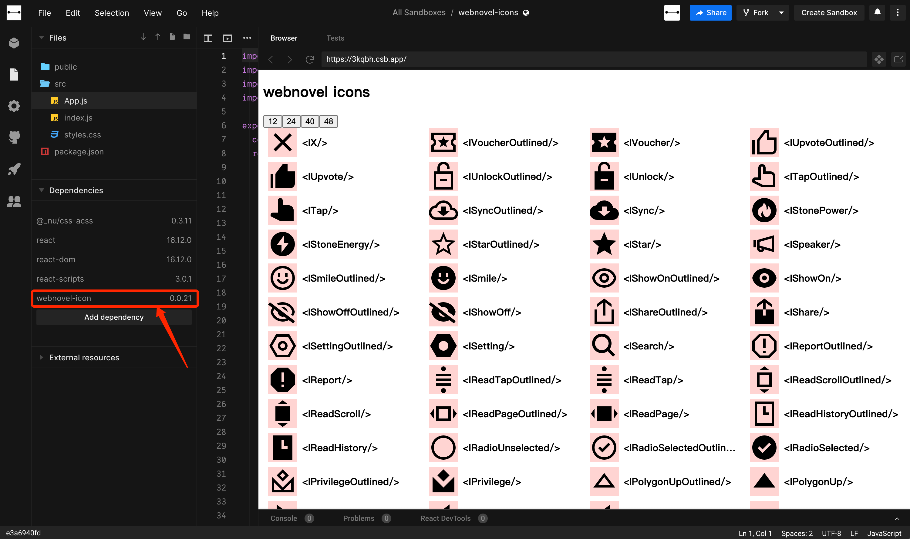

# Icon Automation Workflow Using Figma

It's a repository for [Figma Icon Automation Plugin](https://github.com/leadream/figma-icon-automation).


## in react 

```JSX
import { ISmile } from "webnovel-icons";

function App(){
    return (<svg {...ISmile} width="16" height="16" />);
};
```

## in nunjucks

```HTML


<body>
    {# 动态 创建 SVG 精灵, 这里不能有引号 #}
    {# Api ([], class='', attrs='') #}
    {{ SvgSpirit([ISmile, ISmileOutlined]) }}
    
    {# 或者你也可以添加自定义的 symbol #}
    
        <symbol id="ICustomSvg" viewBox="0 0 24 24"><path d="M22 18V8h-6V2h-4l-6 8v12h12a4 4 0 004-4zM4 10H2v12h2V10z" fill="#000"></path></symbol>
    

    {# 使用 SVG 精灵, 这里需要有引号 #}
    {# Api (id='', size='16', class='', attr='' ) #}
    <p>{{ Svg('ISmile') }} 16px smile Icon</p>
    <p>{{ Svg('ISmileOutlined', 24) }} 24px smile Icon</p>
    <p>{{ Svg('ICustomSvg', 24) }} 24px 自定义图标</p>
</body>
```

如果不想要 SVG 精灵，而是直接输出 SVG 原始 html 字符串可以这样使用。

```HTML


<body>
  {# Api (size='16', class='', attr='' ) #}
  <p>{{ ISmile() }} 16px smile Icon</p>
  <p>{{ ISmileOutlined(24) }}> 24px smile Icon</p>
</body>
```
## in react native

使用 `webnovel-icons/dist/icons.json` 搭配 [react-native-svg](https://github.com/react-native-svg/react-native-svg) 使用

[demo](http://gitlab.inner.yuewen.local/webnovel/mobile-webnovel-js/-/tree/master/libs/icon)

## 开始 / start

Open [Figma](https://www.figma.com/file/9xxUNiOfI21DvnVlyfX3aE/%E3%80%90Webnovel%E3%80%91Assets-%2F-Icon?node-id=5%3A0)

> you need have the acccess to view this figma url

## 安装 Figma 插件 / Install figma plugin

- [figma-icon-automation](https://www.figma.com/community/plugin/739395588962138807/figma-icon-automation)

点击链接下载插件。

## 配置 / settings 



- **GitHub Repo Url**: `https://github.com/yued-fe/webnovel-icons`
- **GitHub token**：联系 [ziven27](https://github.com/ziven27) 获取

1. 打开 Figma 并呼起 `figma-icon-automation` 插件。
2. 填写 GitHub Repo Url 也就是当前 Github 地址。
3. 填写 GitHub Token.

## 发布 / Publish



1. 点击 Update 按钮，跳转到 Publish 页卡。
2. 一定要等到出现黑色加粗文字 `The current version is *.*.*`。
3. 然后填写想要发布的新的版本号，和修改信息，并点击 `push to Github`。

## 合并分支 / Pull requests





1. 点击 `here` 
2. 再点击 `Squash and merge`。

## 查看效果 / Preview



- [codesandbox](https://codesandbox.io/s/webnovel-icons-3kqbh)

然后点击以上链接，并在 Dependencies 中升级 [webnovel-icons](https://www.npmjs.com/package/webnovel-icons) 到刚刚 Figma 中发布的版本，即可看到效果。
